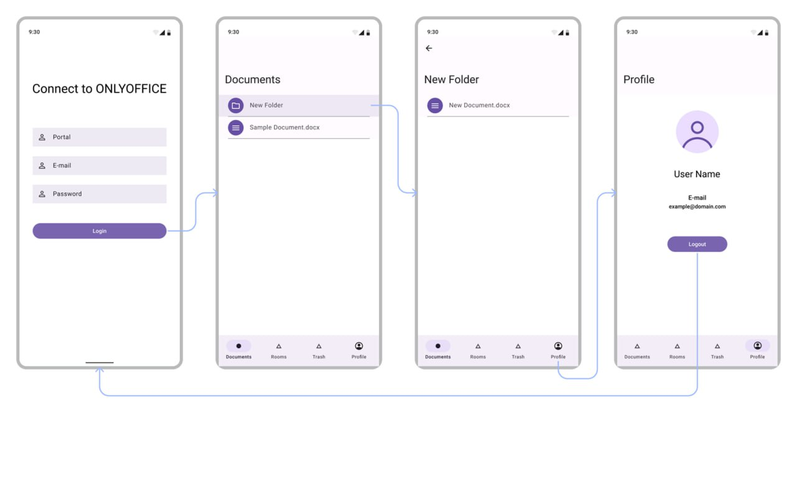

# ONLYOFFICE Android

## О проекте
Прототип Android-приложения для работы с ONLYOFFICE DocSpace, позволяющий управлять документами и совместной работой. Реализован на основе публичного API (api.onlyoffice.com).

## Функциональность
- Авторизация в DocSpace
- Просмотр и навигация по документам
- Просмотр и навигация по комнатам
- Доступ к корзине
- Просмотр профиля пользователя

## Реализация
- Jetpack Compose для UI
- Многомодульная архитектура с MVVM
- Hilt для DI
- Работа с сетью: Retrofit + OkHttp
- Загрузка изображений: Coil
- Kotlin Coroutines + Flow

## Структура приложения
Реализация UI и навигации соответствует предоставленному макету. Основные экраны и переходы между ними реализованы согласно следующей схеме:

